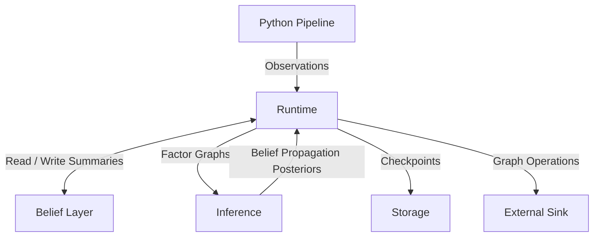

# LI-ESKG

[Paper](https://github.com/Aeluin-Technologies/LI-ESKG/blob/main/papers/paper.pdf) | [GitHub](https://github.com/Aeluin-Technologies/LI-ESKG)

> Reference implementation of the Latent Identity Event-State Knowledge Graph (LI-ESKG) framework.

## Architecture

The framework operates as an asynchronous, event-driven execution pipeline. It isolates raw multi-modal data ingestion from the underlying graph database driver layer.

Upstream perception frameworks stream observations into the engine. The runtime maps these inputs to an in-memory Active Workspace (Belief Layer) managed by an Entity Component System (ECS) architecture, condensing raw history into rolling statistical summaries $b_i = (\theta, \Sigma, \Lambda)$.

For each observation, the engine compiles a temporary factor graph over local Markov blankets and runs the Sum-Product Belief Propagation algorithm to extract marginal posteriors. Maximum a posteriori (MAP) configurations are transformed into abstract `GraphOperation` batches emitted to external storage sinks, while active states are serialized into an embedded RocksDB instance.
